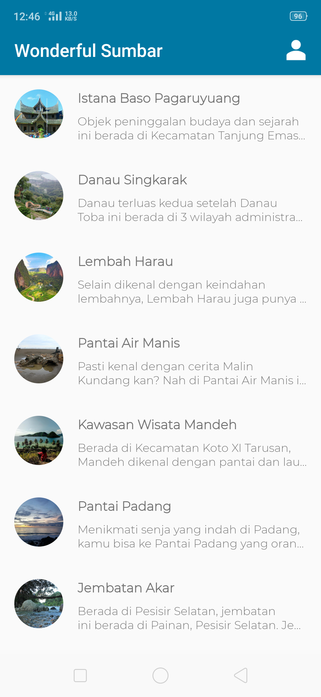

# Dicoding - Belajar Membuat Aplikasi Android untuk Pemula
 
### Submission
Untuk menyelesaikan kelas ini Anda diharuskan submit aplikasi yang Anda buat sendiri. Aplikasi yang akan Anda buat harus menggunakan tema selain yang dicontohkan di latihan Android Pemula dan MADE (aplikasi tidak boleh memiliki tema film, pahlawan atau presiden Indonesia).

### Penampakan
  

### Kriteria
Fitur yang harus ada pada aplikasi:

1. Halaman Utama
Syarat:
- Menampilkan gambar dan informasi dalam format List dengan jumlah minimal 10 item.
- Memunculkan halaman detail ketika salah satu item di tekan.

2. Halaman Detail
Syarat:

- Menampilkan gambar dan informasi pada halaman detail.

3. Halaman About
Syarat:

- Menampilkan foto diri, nama dan email yang terdaftar di Dicoding.

## Note
Bagi teman-teman yang mengambil kelas Belajar Membuat Aplikasi Android untuk Pemula di Dicoding, silahkan menggunakan source ini sebagai referensi. Tetapi **TIDAK** untuk di copas seutuhnya tanpa tau fungsinya.

Jika ada kendala, ayo kita diskusikan bersama :) 

> :muscle: Terus belajar dan tetap semangat teman ! Semua kesulitan pasti bisa dilalui ! Code error melatih kita untuk lebih teliti dan lebih memahami !
